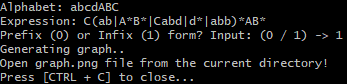
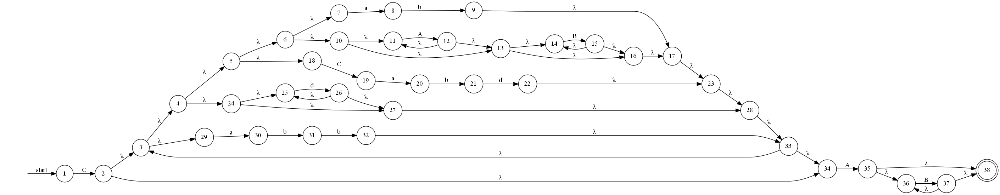

# Regex to NFA

### Prerequisites
In order to make this run on your PC, you will need to:
- install ***g++***
- install ***graphviz*** (might be needed to add it to the *PATH* variable)
- make sure you can run a **dot command** in command prompt *(e.g. dot --help)*

### Running
In order to run the project:
- open a Command Prompt in the project folder
- type **run.sh** and hit *ENTER* (or simply double-click the **run.sh** file in project folder)
- follow the instructions from the command prompt

### Input example

### Output (resulted graph) example

#### Thanks!
